# Нарративный движок — алгоритмическое описание

Движок исполняет истории, написанные на [ink](https://github.com/inkle/ink), и превращает их в
поток «битов» (`Beat`) для визуальной новеллы. Код: `Assets/Scripts/Narrative/`.
Движок ничего не знает про Unity, рендер, звук и время — это чистая C#-библиотека.

Содержание:

1. [Архитектура: два слоя](#1-архитектура-два-слоя)
2. [Загрузка: JSON → граф узлов](#2-загрузка-json--граф-узлов)
3. [Модель исполнения ink VM](#3-модель-исполнения-ink-vm)
4. [Шаг δ: `Step`](#4-шаг-δ-step)
5. [Вывод: склейка, пробелы, `Continue` с lookahead](#5-вывод-склейка-пробелы-continue-с-lookahead)
6. [Выбор: `ProcessChoice` → `ChooseChoiceIndex`](#6-выбор)
7. [Потоки, туннели, функции: `CallStack`](#7-потоки-туннели-функции-callstack)
8. [Счётчики визитов и ходов](#8-счётчики-визитов-и-ходов)
9. [Случайность](#9-случайность)
10. [Сохранение и загрузка](#10-сохранение-и-загрузка)
11. [Слой `StoryMachine`: автомат визуальной новеллы](#11-слой-storymachine)
12. [Стиль: разбор строк и вариантов](#12-стиль-разбор-строк-и-вариантов)
13. [Ошибки](#13-ошибки)
14. [Сложность](#14-сложность)
15. [Как это проверяется](#15-как-это-проверяется)

---

## 1. Архитектура: два слоя

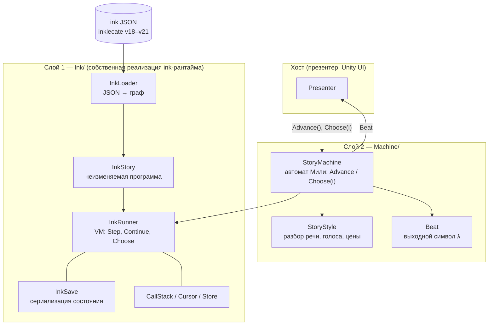

* **Слой 1 (`Ink/`)** — воспроизводит *наблюдаемую* семантику референсного ink-рантайма
  (текст, теги, выборы, переменные, случайные числа), но с другим устройством: узлы с байтовым
  опкодом вместо типов, всё, что референс разрешает лениво (пути, имена глобалов), резолвится один
  раз при загрузке.
* **Слой 2 (`Machine/`)** — превращает «VM, которая выдаёт текст» в детерминированный автомат с
  двумя входами. Именно он — API для игры.

`InkStory` неизменяем после загрузки: один `InkStory` может обслуживать любое число `InkRunner`
(прохождений) — все изменяемые данные живут в раннере.

---

## 2. Загрузка: JSON → граф узлов

`InkLoader.Load(json)`:

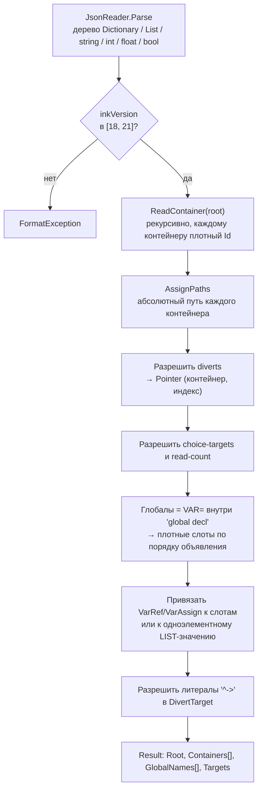

**Модель программы** (`Program.cs`) — дерево из `Container` и листовых `Node`:

| Узел | Опкод `Op` | Смысл |
|---|---|---|
| `Container` | `Container` | массив `Content[]` + словарь `Named`, флаги подсчёта, `Id`, `Path` |
| `TextNode` | `Text` | текст (`^…` в JSON) |
| `GlueNode` | `Glue` | `<>` |
| `CommandNode` | `Command` | управляющая команда (`Cmd`, 26 штук) |
| `DivertNode` | `Divert` | переход: статический, по переменной, функция `f()`, туннель `->t->`, внешняя `x()` |
| `ChoicePointNode` | `ChoicePoint` | точка выбора + флаги (условие, start/choice-only текст, invisible default, once-only) |
| `VarRefNode` / `VarAssignNode` | `VarRef` / `VarAssign` | чтение / запись переменной |
| `ReadCountNode` | `ReadCount` | `CNT?` — число визитов |
| `NativeNode` | `Native` | оператор из таблицы `NativeOps` |
| `LiteralNode` | `Literal` | константа, divert-target, указатель на переменную, список |
| `TagNode` | `Tag` | статический тег до ink 1.1 |

**Программный счётчик** — `Pointer(Container, Index)`. `Index == -1` означает «сам контейнер,
будет введён на следующем шаге». Путь вида `knot.0.c-1` разбирается один раз; промах при разборе
возвращает самый глубокий достигнутый объект с пометкой `approximate` (то же правило восстановления,
что в референсе).

**Значения** (`Value`) — размеченное объединение-структура (без боксинга чисел). Порядок `ValueKind`
задаёт **решётку приведения** ink:

```
Bool < Int < Float < List < String < DivertTarget < VariablePointer
```

Бинарная операция поднимает оба операнда до большего вида (`NativeOps.Call`), затем применяет
оператор для этого вида: `int` — с переполнением по кругу, деление целых — с усечением и т. д.
`Void` и `Tag` — значения только для стека.

---

## 3. Модель исполнения ink VM

Формально `InkRunner` — **расширенный конечный автомат со стековой памятью**:

* **управляющее состояние** — `Pointer` текущего фрейма;
* **расширенное состояние** — `(CallStack, Eval, Output, Globals, Visits, Turns, TurnIndex, Seed, PreviousRandom)`;
* **функция переходов δ** — `Step()`;
* `Continue()` итерирует δ до границы строки.

Расширенное состояние делится на две части с разными стратегиями отката:

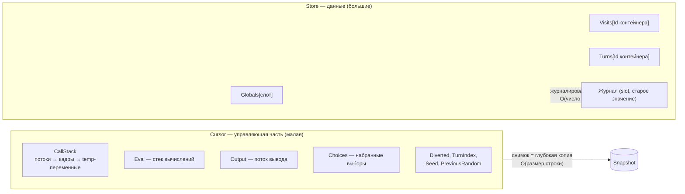

* `Cursor` мал (строка вывода, пара кадров) → снимок это простая глубокая копия
  (`CopyFrom`, с повторным использованием уже выделенных списков/кадров — в установившемся режиме
  без аллокаций).
* `Store` может быть большим → вместо копирования пишется **журнал**: пока открыт снимок, каждая
  запись пишет `(вид, слот, старое значение)`. Откат — проигрывание журнала в обратном порядке
  (применение обратной дельты), фиксация — просто очистка журнала. Цена — O(записей после
  новой строки), а не O(размер состояния).

---

## 4. Шаг δ: `Step`

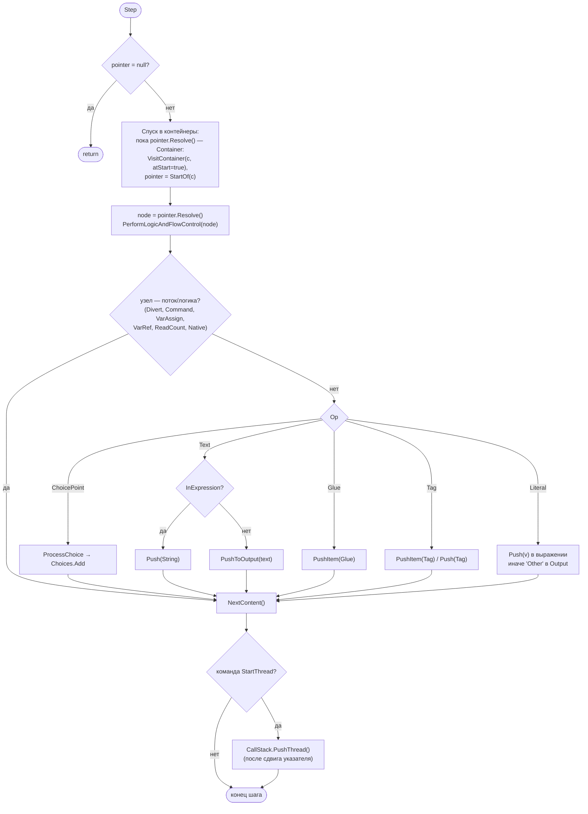

**`NextContent`** — выбор следующего указателя:

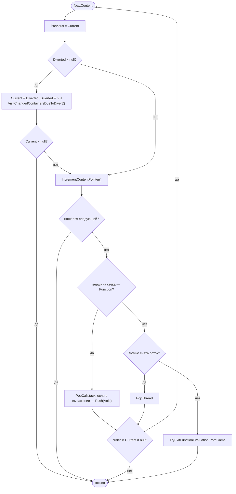

**`IncrementContentPointer`** — это «обход в глубину вверх»: увеличить индекс в текущем
контейнере; если вышли за конец — подняться к родителю и взять `container.Index + 1`; повторять,
пока не найдётся место или не дойдём до корня (тогда указатель становится `null` — конец потока).

**Режим выражения** (`InExpression`, флаг кадра). Между командами `ev` и `/ev` литералы, значения
переменных и текст кладутся в стек `Eval`, а не в `Output`; `out` выводит верхушку стека в поток.
Так скомпилирована вся арифметика, условия и интерполяция `{…}`.

**Команды** (`Cmd`) группируются так:

| Группа | Команды |
|---|---|
| вычисление | `EvalStart`, `EvalEnd`, `EvalOutput`, `Duplicate`, `PopEvaluatedValue`, `NoOp` |
| потоки управления | `PopFunction`, `PopTunnel`, `StartThread`, `Done`, `End` |
| строки / теги | `BeginString`, `EndString`, `BeginTag`, `EndTag` |
| метаданные | `ChoiceCount`, `Turns`, `TurnsSince`, `ReadCount`, `VisitIndex` |
| случайность | `Random`, `SeedRandom`, `SequenceShuffleIndex`, `ListRandom` |
| списки | `ListFromInt`, `ListRange` |

---

## 5. Вывод: склейка, пробелы, `Continue` с lookahead

### 5.1. Поток вывода

`Output` — список `OutItem` (`Text`, `Glue`, `BeginString`, `BeginTag`, `EndTag`, `Tag`, `Other`).
Текст добавляется через `PushItem`, который применяет правила обрезки:

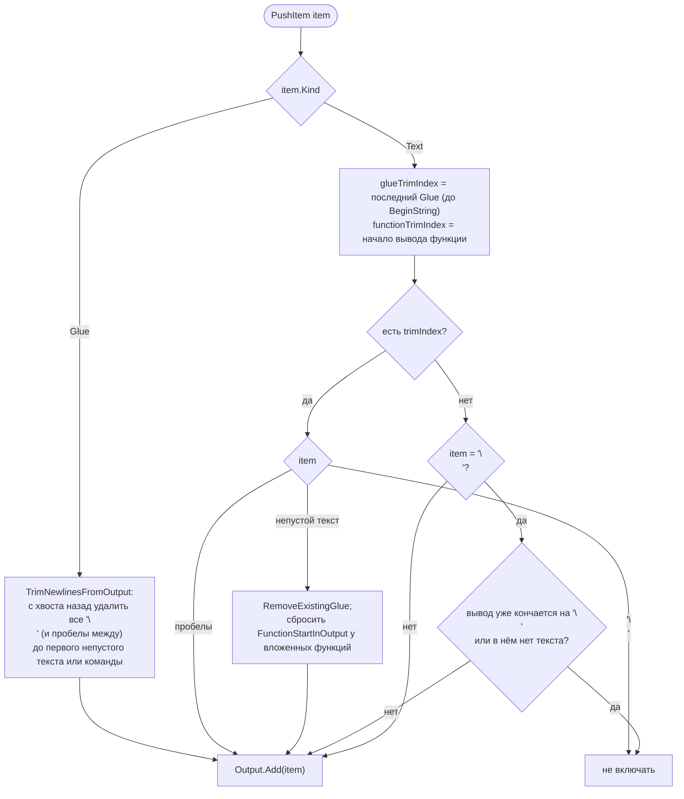

Инварианты: строка никогда не начинается с `\n` и не содержит двух `\n` подряд; перед `\n` и в
начале строки пробелы убираются; серии пробелов/табов схлопываются в один пробел
(`Cursor.CleanWhitespace`).

`PushToOutput` предварительно дробит строку функцией `SplitHeadTailWhitespace` на
«голова-перевод-строки / тело / хвост-перевод-строки», чтобы глю могло убирать переводы строк по
одному.

### 5.2. Почему нужен lookahead

Строка ink заканчивается на `\n`, но **последующая** глю `<>` может этот `\n` отменить:

```ink
Привет,
<> мир
```

Значит, увидев `\n`, нельзя сразу отдавать строку: надо проверить, что будет дальше. Эталонный
рантайм делает это через копию всего состояния; здесь — через **снимок + журнал** (раздел 3).

### 5.3. `Continue`

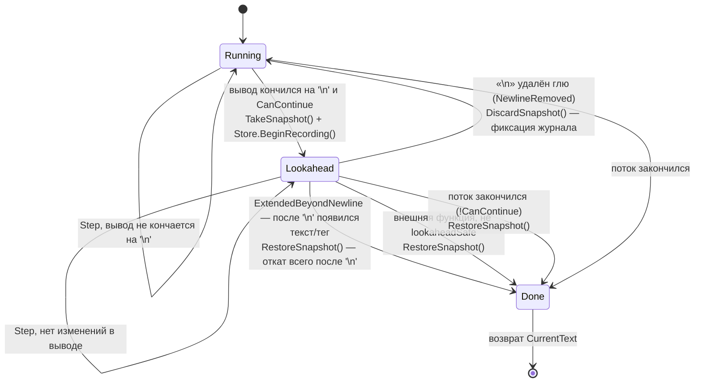

Исход `NewlineChangeSinceSnapshot` — один из четырёх: `NoChange`, `ExtendedBeyondNewline`,
`NewlineRemoved`, `Unknown`.

* **Быстрый путь.** Если с момента снимка из `Output` ничего не удалялось (`Removals` не
  изменился) и тег не открыт, то поток = снимок ++ суффикс, а очистка текста не меняет префикс,
  оканчивающийся на `\n`. Поэтому ответ определяется *только суффиксом*: достаточно пройти его и
  найти непустой `Text` — O(|суффикс|), без аллокаций. Любая работа с тегами или удалениями
  откатывается на эталонное определение на полностью перестроенном тексте.
* **Нет снимков внутри строкового вычисления** (`InStringEvaluation`: между `BeginString` и
  `EndString`, т. е. при построении текста выбора и `"{func()}"`).
* **Внешние функции.** Функция с побочным эффектом (`lookaheadSafe == false`) не должна
  запускаться спекулятивно: при открытом снимке вызов отменяется, выставляется
  `_sawLookaheadUnsafeFunctionAfterNewline`, и строка завершается (откат к снимку).

Снимок один за раз; «запасной» курсор (`_spare`) переиспользуется для следующего снимка.

---

## 6. Выбор

Каждая `ChoicePointNode` порождает кандидат-выбор при проходе по ней в `Step`:

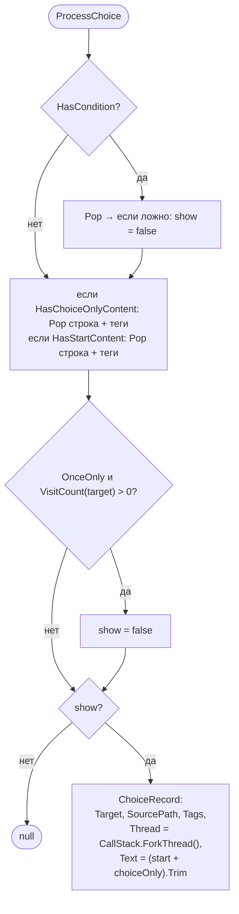

Ключевые моменты:

* Текст выбора = «начальный» + «только в выборе» (`[ ]` в ink). Собираются из стека, куда они
  попали как строки через `BeginString`/`EndString`; теги выбора подбираются с вершины стека.
* **Выбор запоминает форк потока**, в котором он создан (`ForkThread`) — ведь когда игрок
  выберет, исходный поток уже может быть снят (`<-` threads). Выбор возобновляет *именно тот*
  контекст.
* `once-only` проверяется по счётчику визитов целевого контейнера — отсюда `Container.CountsVisits`
  для всех целей таких выборов (устанавливает компилятор через флаги).

**Конец потока и выборы.** Когда `CanContinue` стал ложным, `ContinueSingleStep` вызывает
`TryFollowDefaultInvisibleChoice`: если *все* набранные выборы — «невидимые по умолчанию»
(`* ->`, fallback), автоматически выбирается первый — без хода игрока и без инкремента хода
(`TurnIndex`). Если при этом открыт снимок, поток выбора форкается ещё раз, чтобы откат не испортил
его.

**`ChooseChoiceIndex(i)`:**

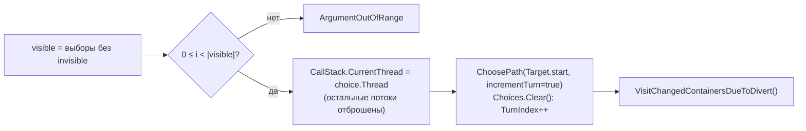

`CurrentChoices` перенумеровывает видимые выборы с 0 (индексы невидимых «съедаются»).

---

## 7. Потоки, туннели, функции: `CallStack`

`CallStack` — **стек потоков, каждый поток — стек кадров**:

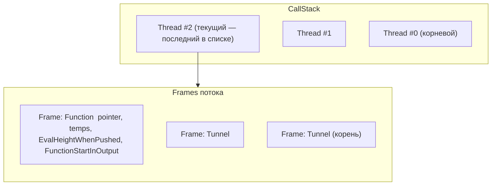

| Тип кадра | Создаётся | Снимается |
|---|---|---|
| `Tunnel` (`->t->`) | divert с `PushesToStack` | команда `->->` (может переопределить цель) |
| `Function` (`f()`) | divert с `PushesToStack` | `~ret` или выход за конец контейнера функции |
| `FunctionEvaluationFromGame` | `EvaluateFunction` из хоста | после возврата значения хосту |

**Потоки** (`<- name`): `StartThread` форкает *текущий* поток (после сдвига указателя, чтобы
возврат из потока продолжил после `<-`), новый поток становится текущим. Достижение конца потока
(`Done`/выход за контейнер) снимает его и возвращает к родителю. Потоки нужны для сбора выборов из
нескольких источников; к концу `Continue` они должны быть «плоскими» (иначе ошибка).

**Временные переменные** живут в `Frame.Temps` (лениво создаваемый словарь). Адрес переменной —
**индекс контекста**: `0` — глобальная, `n` — кадр `n−1` текущего потока. Указатели
(`ref`‑параметры) хранят пару `(имя, contextIndex)`; чтение/запись идут по цепочке указателей до
настоящей переменной (`GetVariable` / `Assign`).

**Порядок поиска имени:** глобальные → одноэлементный LIST → temp (как в ink).

**`EvaluateFunction(name, args)`** — вызов ink-функции из хоста без продвижения истории:
сохраняет `Output`, кладёт кадр `FunctionEvaluationFromGame`, пушит аргументы, гонит `Continue` до
конца, достаёт возвращаемое значение со стека, восстанавливает `Output`.

---

## 8. Счётчики визитов и ходов

`Store.Visits[Id]` и `Store.Turns[Id]` — массивы, индексируемые плотным `Container.Id`
(без словарей по путям). Какие контейнеры считаются — решает компилятор ink через флаги
`#f` (`CountVisits`, `CountTurns`, `CountStartOnly`).

Две точки увеличения:

1. **`Step` при входе в контейнер сверху вниз** — `VisitContainer(c, atStart: true)`.
2. **`VisitChangedContainersDueToDivert`** после любого перехода: считаются все контейнеры,
   которые *впервые вошли* на пути вниз к цели.

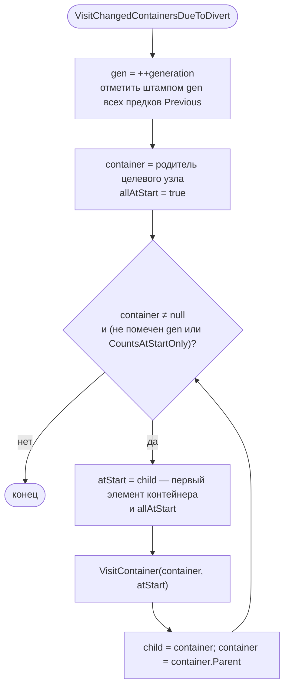

«Штамп поколения» (`_stamp[Id] = gen`) заменяет аллокацию `HashSet` на каждый переход: проверка
«этот контейнер предок прошлого указателя?» за O(1).

* `TURNS_SINCE(-> x)` = `TurnIndex − Turns[x]` либо `-1`, если не посещали (`NoTurn`).
* `TurnIndex` растёт только на выбор игрока (`ChooseChoiceIndex`, `ChoosePathString`), но не при
  автоматическом выборе невидимого default.

---

## 9. Случайность

Вся случайность воспроизводима и *побитово совпадает* с референсным ink (и с `System.Random`
.NET), поэтому результаты одинаковы в редакторе, inky и IL2CPP.

* `InkRandom` — **субтрактивный генератор Кнута** (алгоритм «Net5CompatSeed», остаточный
  массив из 56 слов, `MBig = int.MaxValue`, `MSeed = 161803398`). Реализован руками, чтобы не
  зависеть от версии рантайма.
* **`RANDOM(min, max)`:**
  `next = First(Seed + PreviousRandom)`;  результат `next % (max−min+1) + min`;
  затем `PreviousRandom = next`. То есть «состояние генератора» — пара `(Seed, PreviousRandom)`,
  и именно она сохраняется.
* **`SEED_RANDOM(x)`** — `Seed = x`, `PreviousRandom = 0`.
* **`LIST_RANDOM`** — аналогично, индекс = `next % Count`.
* **Начальный seed** — `First(DateTime.UtcNow.Millisecond) % 100` (как в ink); в тестах и играх с
  воспроизводимостью задаётся явно.

### Перемешанные последовательности (`{~a|b|c}`)

`NextSequenceShuffleIndex` — **детерминированная перестановка**, не зависящая от
`PreviousRandom`:

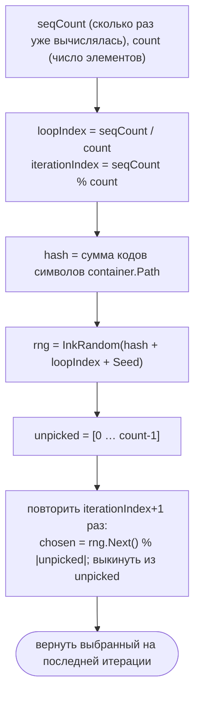

Следствие: в рамках одного «круга» (`loopIndex`) последовательность — настоящая перестановка
(без повторов), а при повторном заходе (`seqCount` растёт) порядок свой на каждый круг, но
воспроизводим для данной `(последовательность, seed)`.

---

## 10. Сохранение и загрузка

`InkSave` (формат `inkSave`, версия 1). Принципы:

* **Позиции — по путям**, не по индексам: `(container path, index)`. Сохранение переживает правки
  несвязанных частей истории.
* **Глобалы — по имени и только если отличаются от значений по умолчанию**
  (`Defaults` = значения сразу после выполнения `global decl`). Новая переменная в обновлённой
  истории получает значение по умолчанию.
* **Счётчики — по пути контейнера**; нулевые не пишутся.
* Значения кодируются теми же токенами, что и сам ink-JSON (`^text`, `{"^->":path}`,
  `{"list":{…}}`…).

Что входит в сохранение: `turn`, `seed`, `previousRandom`, `globals`, `visits`, `turns`,
`threads` (кадры → pointer, temps, тип…), `threadCounter`, `output`, `choices` (каждый со своим
потоком), `eval`, `diverted`.

```mermaid
sequenceDiagram
    participant H as Хост
    participant R as InkRunner
    participant S as InkSave
    H->>R: SaveState() (между Continue)
    R->>S: Write(runner)
    S-->>H: JSON
    Note over H,S: …позже…
    H->>R: LoadState(json)
    R->>S: Read(runner, json)
    S->>S: Globals = Defaults; применить diff
    S->>S: Visits/Turns: обнулить, применить
    S->>S: потоки, output, choices, eval → новый Cursor
    S->>R: ReplaceState(cursor); _snapshot = null
```

Если путь из сохранения не найден — `FormatException` с понятным текстом
(«Has the story changed since this save?»). Незнакомые глобалы пропускаются.

`StoryMachine.Save()` оборачивает это: `{ storyMachine: 1, phase, [error], ink: {…} }`.
При `Load` `Beat` **перестраивается из состояния** (из `CurrentText`/`CurrentChoices`), а не
хранится.

---

## 11. Слой `StoryMachine`

Автомат Мили `M = (Q, Σ, Λ, V, δ, λ, q₀, v₀)`:

| Компонент | В коде |
|---|---|
| `Q` — состояния | `StoryPhase`: `Ready`, `Line`, `Directive`, `Choice`, `End`, `Fault` |
| `Σ` — входы | `Advance`, `Choose(i)` |
| `Λ` — выходы | `Beat` (фаза, голос, спикер, текст, теги, опции, дельта переменных) |
| `V` — расширенное состояние | всё состояние `InkRunner` |
| `δ`, `λ` | `Transition` (внутри `Advance`/`Choose`) |
| `q₀` | `Ready` |

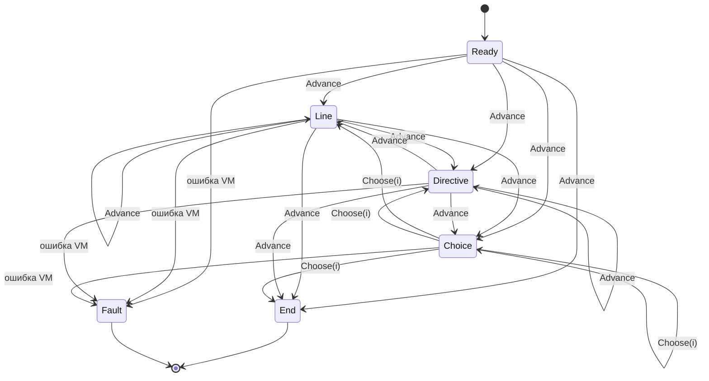

`End` и `Fault` **поглощающие**: из них ни один вход не выводит.

**Охранные условия** (guards) делают δ тотальной:

* `CanAdvance` = фаза ∈ {`Ready`, `Line`, `Directive`};
* `CanChoose(i)` = фаза = `Choice` и `0 ≤ i < Options.Count`.

Недопустимый вход возвращает `false` и *не меняет ни `q`, ни `V`*.

### Алгоритм перехода

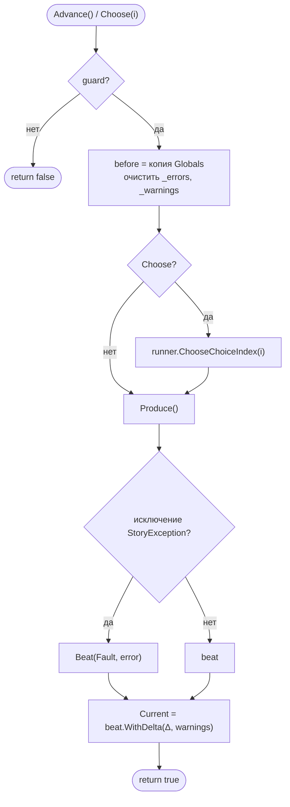

**`Produce()`** — цикл «гнать VM, пока не появится что показать»:

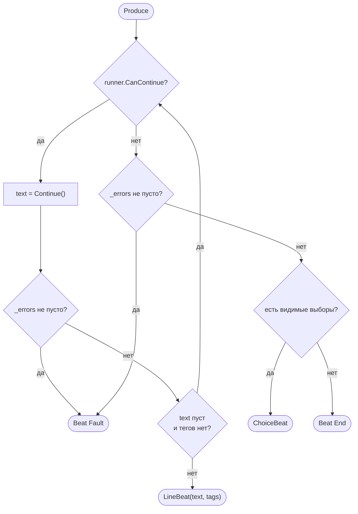

Пустые строки (чистая логика ink: `~ x = 1`) в `Beat` не попадают — они молча проглатываются.
Строка без текста, но с тегами — `Directive` (команды сцене: фон, музыка).

**Дельта** `Δ = {(name, v, v′) | v ≠ v′}` — сравнение `Globals` до и после перехода по порядку
объявления; значения сравниваются `Value.SameAs`. Запись из хоста (`SetVariable`) в дельту не
попадает.

`Beat` иммутабелен; остаётся валидным до следующего принятого входа.

---

## 12. Стиль: разбор строк и вариантов

`StoryStyle` — чистые функции без состояния, правила автора можно менять без правки автомата.

**`ParseLine(line, tags) → (voice, speaker, text)`**

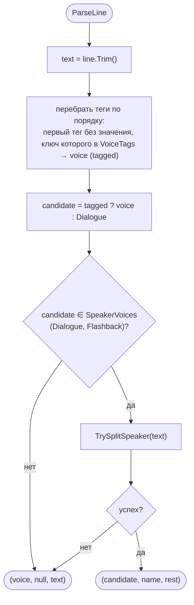

**`TrySplitSpeaker`** принимает «Имя: реплика», только если:

1. двоеточие найдено, `0 < позиция ≤ MaxSpeakerLength (40)`;
2. после двоеточия пробел (чтобы «12:30» не считалось репликой);
3. в имени нет `. ! ? « " (`.

Неразмеченная строка без спикера остаётся `Narration` (`voice` по умолчанию).

Теги: `# narr`, `# thought`, `# system`, `# flashback`, `# sfx`.
`StoryTag.Parse("key: value")` делит по первому двоеточию; тег без двоеточия — `Value = null`.

**`ParseOption`** — платные варианты: начинаются с `💎`, заканчиваются `(N 💎)`:

```
💎 Взять нож (5 💎)   →   text = "Взять нож", isPremium = true, cost = 5
```

---

## 13. Ошибки

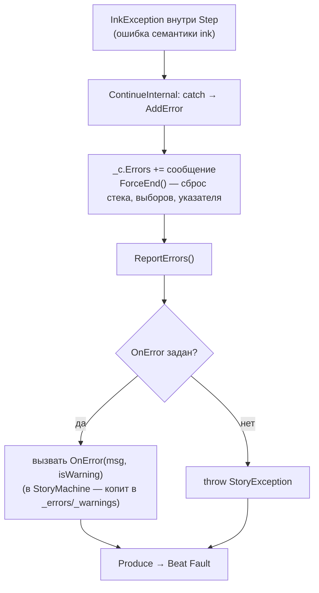

* **Ошибка** останавливает историю: `ForceEnd`, `CanContinue == false`. `StoryMachine` превращает
  её в `Beat(Fault)` — поглощающее состояние.
* **Предупреждение** (`Warning`: например, «переменная не найдена, использую 0») — копится и
  попадает в `Beat.Warnings`, историю не прерывает.
* После окончания потока без `-> END`/`-> DONE`/выбора выдаётся диагностическое сообщение
  (нужен ли `->->`, `~ return`, `-> DONE`).
* Ссылка на внешнюю функцию без привязки: если разрешены fallback (`AllowExternalFunctionFallbacks`
  по умолчанию), вызывается ink-функция с тем же именем.

---

## 14. Сложность

| Операция | Цена | Комментарий |
|---|---|---|
| Загрузка | O(размер JSON) | один проход + разрешение путей один раз |
| Шаг `Step` | O(1) амортизированно | диспетчеризация по байту `Op`, глобалы по слоту |
| Чтение/запись глобала | O(1) | плотные слоты вместо хеширования имён |
| Счётчики | O(1) | массивы по `Container.Id` |
| Divert → счётчики | O(глубина дерева) | штампы поколения, без аллокаций |
| Снимок lookahead | O(размер строки + глубина стека) | глубокая копия `Cursor`, переиспользование объектов |
| Журнал `Store` | O(числа записей после `\n`) | запись O(1), откат O(записей) |
| Решение «`\n` отменён?» | O(\|суффикс\|) | быстрый путь, иначе O(длина строки) |
| `PushItem` | O(\|вывод\|) в худшем случае | обход назад до глю/BeginString |
| Перемешанная последовательность | O(count²) | `RemoveAt` из списка; count мал |
| Save | O(контейнеры + глобалы) | пишутся только ненулевые/изменённые |
| `StoryMachine.Delta` | O(число глобалов) | копия `Globals` перед и сравнение после |

Память: один `InkStory` на все раннеры; раннер — массивы фиксированного размера
(`Globals`, `Visits`, `Turns`) + малый `Cursor`.

---

## 15. Как это проверяется

`task test` (в Docker, см. `Taskfile.yml`) гоняет `Tests/Narrative`:

| Набор | Что проверяет |
|---|---|
| `DifferentialTests` / `ApiDifferentialTests` | **дифференциальное тестирование** против официального ink-рантайма на корпусе историй: тот же текст, теги, выборы, переменные, счётчики; то же публичное API (`EvaluateFunction`, `ChoosePathString`, теги…) |
| `MachineTests.Invariants_Hold_On_Every_Beat` | на 40 случайных прогулках: нет `Fault`; `Choice ⇔ есть опции`; `Line` всегда с текстом; `Directive` всегда с тегами; текст без хвостового `\n` |
| `Transition_Function_Is_Total_Via_Guards` | недопустимый вход отвергается и не меняет состояние |
| `Deterministic_Given_Seed_And_Inputs` | один seed + одни входы → одинаковые `Beat` |
| `Load_After_Save_Is_Observationally_Identity` | сохранить/загрузить в любой точке → неотличимо |
| `Deltas_Compose_To_Final_Variables` | сумма дельт даёт финальные значения переменных |
| `UnitTests` | `InkRandom` совпадает с `System.Random`; JSON round-trip; откат журнала = точная обратная операция |
| `StyleTests` | разбор речи, голосов, тегов, цен |

`task bench` сравнивает время и аллокации на реальном эпизоде с официальным рантаймом.

Запуск ink-компилятора: `task ink` (`content/stories/**/*.ink` → `buckets/stories/**/*.json`).
